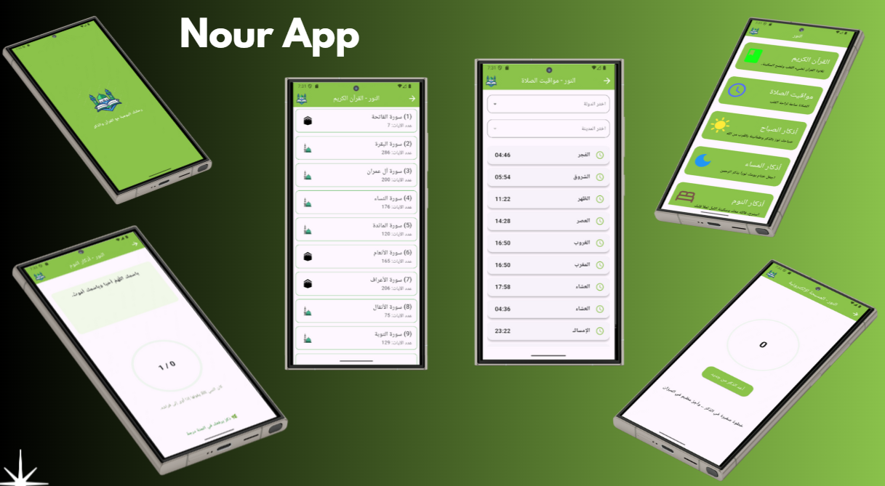

# 🌙 Nour App - Flutter

**Nour App** is a Flutter application designed to enrich your spiritual life by providing access to the Holy Quran, prayer times, and daily Azkar (remembrances). The app is built with **Material Design principles** and offers a smooth, intuitive experience for users seeking guidance and tranquility.

--
## 📌 Features

- **Holy Quran**: Browse Quran pages with images and access surahs.  
- **Prayer Times**: Fetch accurate prayer times based on the selected city using an API.  
- **Morning Azkar**: Daily morning remembrances to start your day with peace.  
- **Evening Azkar**: Evening remembrances for a peaceful closure to your day.  
- **Sleep Azkar**: Remembrances before sleep for serenity and protection.  
- **Digital Tasbeeh (Masbaha)**: Count your dhikr with an interactive electronic tasbeeh.

--
## 📌 Screens / Pages

1. **Home Screen**: Central hub to navigate to Quran, prayer times, and Azkar.  
2. **Quran Screen**: Displays Quran pages as images. Data fetched from:
   - `https://mp3quran.net/api/quran_pages_arabic/` – Quran pages images  
   - `https://api.quran.com/api/v4/chapters/` – Surahs and chapter information  
3. **Prayer Times Screen**: Shows prayer times using **Aladhan API** based on the city:
   - `https://api.aladhan.com/v1/timingsByCity?city={city}&country={country}&method=2`  
4. **Athkar Screens**: Displays morning, evening, and sleep remembrances.  
5. **Masbaha Screen**: Interactive electronic tasbeeh to count dhikr.

--
## 📌 Widgets & Components Used

- **MaterialApp & Scaffold** → Base app structure  
- **AppBar** → Navigation bar for each screen  
- **ListView & Column** → Organize content vertically  
- **ScreenWidget** → Custom widget for home screen tiles  
- **Card & ListTile** → Display prayer times and Azkar  
- **DropdownButtonFormField** → Select country/city for prayer times  
- **CircularProgressIndicator** → Loading indicators  
- **Alert Dialogs** → Feedback and confirmations for Masbaha  

--
## 📌 APIs Used

- **Quran Pages API**: Fetch Arabic pages as images  
- **Quran Surah API**: Fetch surah information and chapter details  
- **Aladhan Prayer Times API**: Fetch prayer times based on city and country  

## 📷 Screens 

  
